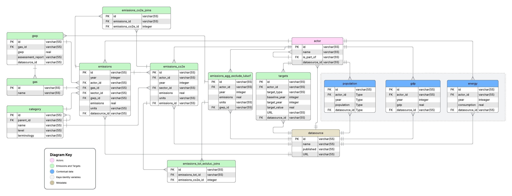

# Database documentation

The LEDGER database is the core data layer of the GHG Tracker Project. It is built on [Postgres](https://www.postgresql.org/) for robust, scalable storage and uses [alembic](https://alembic.sqlalchemy.org/en/latest/) to manage schema migrations. Database models are defined using [SQLModel](https://sqlmodel.tiangolo.com/), a Python library that combines the power of SQLAlchemy and Pydantic. This approach ensures that the database schema remains programmatically accessible to new developers.

## Development

Checkout the repository if you want to contribute to the database design and/or data ingestion:

[GitHub Repo](https://github.com/GHG-Tracker-Project/ledger-database){ .md-button .md-button--primary }
