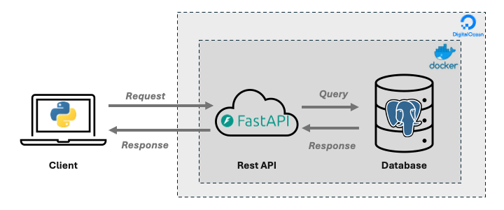

# GHG Tracker Project Documentation

!!! note

    This documentation is still under active development and may be incomplete

The GHG Tracker Project is an [open science](https://www.unesco.org/en/open-science/about?hub=686) initiative that provides comprehensive data on greenhouse gas (GHG) emissions and climate targets across national and subnational levels (e.g., states, provinces, and cities). The project harmonizes emissions data, reduction targets, and related socioeconomic indicators into a unified framework for reproducible analysis.

At the core of the GHG Tracker Project is **LEDGER** (Linked Envionrment Data and Greenhouse Emissions Resource), an open-source data architecture that includes:

- **A [PostgreSQL](https://www.postgresql.org/) database** that stores harmonized data
- **A [FastAPI](https://fastapi.tiangolo.com/) service** that enables structured and performant data queries
- **A [Python](https://www.python.org/) client** library that provides high-level programmatic access to the API (we plan to expand support to other languages based on community demand.)

The **LEDGER** database and API are currently deployed on [Digital Ocean](https://www.digitalocean.com/).

## Support

This project is funded and supported by:

- [Yale Center for Natural Carbon Capture (YCNCC)](https://naturalcarboncapture.yale.edu/)
- [Yale Center for Geospatial Solutions (YCGC)](https://geospatial.yale.edu/)
